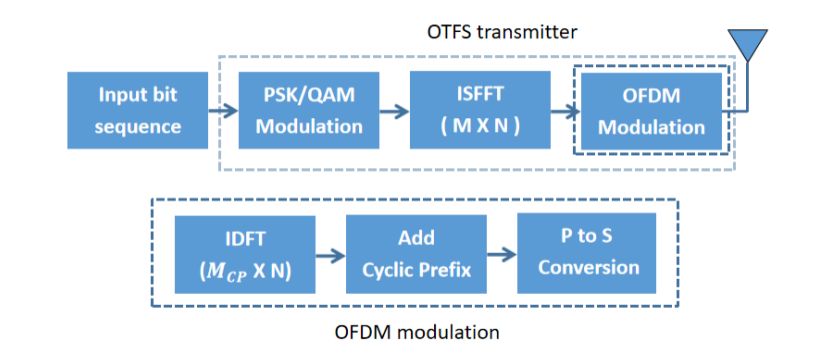

# Deep Learning-Based Automatic Modulation Recognition in OTFS and OFDM systems

---

### Introduction

**Background:**   Automatic modulation recognition (AMR) is one of the most essential techniques in non-cooperative orthogonal time frequency space (OTFS) and orthogonal frequency division multiplexing (OFDM) communication systems. Since coexistence of OTFS and OFDM is a potential and practical solution in  the future wireless communication scenarios, classification of the OTFS scheme and the OFDM scheme will be a challenging and meaningful task. 

This is the code for  our paper ["Deep Learning-Based Automatic Modulation Recognition in OTFS and OFDM systems"](https://ieeexplore.ieee.org/document/10200971). In this paper, we propose a deep learningbased method, including multi-layer convolution neural networks (CNNs) and an attention-based residual Squeeze-and-Excitation Module (SE), to extract effective characteristics of OTFS and OFDM signals in multi-path Doppler spread fading channel.

This repo consists of two parts: the **transmitter* and the **deep learning-based* model.

---

### Transmitter

Transmitter module aims to produce the OTFS data and OFDM data. According to above figure, the process of generating OTFS signals is related to OFDM modulation.

First, we produce OTFS data and OFDM data via MATLAB. You can refer to the file *otfs_syn.m* and  *ofdm_syn.m* for the OTFS modulation and OFDM modulation, respectively.

---

### Deep Learning-based model

Then, we employ the classic CNN-5 model to realize the classification. SE module is leveraged to extract global features. Results show that attention-based module can also deal with the signal which is corrupted by Doppler effect.

The model is realized in **model.py**.  You can run this code directly by

`python model.py`

where the file 1.mat  is a OTFS sample generated by *otfs_syn.m*. 

If the entire process is requested, you can reproduce a training module and a evalulating module with the file *model.py* by yourself.

We will update this part next time.

---

## Citation

If you find something helpful, you are welcome to cite this work.

`@INPROCEEDINGS{10200971,
  author={Zhou, Jinggan and Liao, Xuewen and Gao, Zhenzhen},
  booktitle={2023 IEEE 97th Vehicular Technology Conference (VTC2023-Spring)}, 
  title={Deep Learning-Based Automatic Modulation Recognition in OTFS and OFDM systems}, 
  year={2023},
  volume={},
  number={},
  pages={1-5},
  keywords={Wireless communication;Training;Time-frequency analysis;Vehicular and wireless technologies;Transmitters;OFDM;Modulation;Orthogonal time frequency space (OTFS);automatic modulation recognition (AMR);deep learning;Squeeze-and-Excitation networks},
  doi={10.1109/VTC2023-Spring57618.2023.10200971}}`
