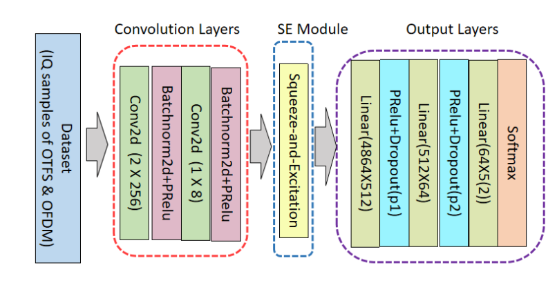

# Deep Learning-Based Automatic Modulation Recognition in OTFS and OFDM Systems

Official code for our VTC2023-Spring paper:

> **J. Zhou, X. Liao and Z. Gao**, *"Deep Learning-Based Automatic Modulation Recognition in OTFS and OFDM systems,"* 2023 IEEE 97th Vehicular Technology Conference (VTC2023-Spring), Florence, Italy, 2023, pp. 1-5. [IEEE Xplore](https://ieeexplore.ieee.org/document/10200971) · DOI: 10.1109/VTC2023-Spring57618.2023.10200971

## Overview

OTFS (Orthogonal Time Frequency Space) and OFDM (Orthogonal Frequency Division
Multiplexing) are expected to **coexist** in future wireless systems, so a
receiver must tell the two schemes apart — a special case of **automatic
modulation recognition (AMR)**. This is hard in practice because both signals
travel through a multipath-Doppler fading channel that distorts their
distinguishing features.

We propose a compact **deep-learning classifier** that works directly on a short
span of the received complex baseband signal:

1. **Transmitter (MATLAB):** generate OTFS and OFDM waveforms through a
   multipath Rayleigh channel with Doppler spread + AWGN.
2. **CNN front-end (conv-5 style):** convolve the real/imaginary parts of the
   received signal to extract time-frequency features.
3. **Squeeze-and-Excitation (SE) attention:** recalibrate channel-wise features,
   which is what lets the model resist Doppler-induced distortion.
4. **Classification head:** output the air-interface label (OFDM / OTFS).



## Repository structure

```
OTFS_AMC/
├── model.py            # OTFS_OFDM_CNN (CNN + SE attention)
├── dataset.py          # .mat signal dataset + collate
├── utils.py            # data split + train/eval loops
├── train.py            # training entry point
├── evaluate.py         # accuracy + per-class + confusion matrix
├── predict.py          # single-sample inference
├── prepare_data.py     # organize MATLAB output into class folders
├── transmitter/        # MATLAB waveform generators
│   ├── otfs_syn.m
│   └── ofdm_syn.m
├── experiments/
│   └── multiclass/     # extended multi-modulation recognition (Conv3D)
├── pic/                # figures used in this README
├── 1.mat               # one bundled OTFS sample (smoke-test / demo)
└── weights/            # training outputs (created on demand)
```

## Requirements

```
torch>=1.10
numpy
scipy
tqdm
matplotlib        # only for saving the confusion-matrix figure
tensorboard       # only for training logging (optional)
```

Install:

```bash
pip install -r requirements.txt
```

The transmitters additionally require **MATLAB** with the **Communications
Toolbox** (`comm.RayleighChannel`, `pskmod`, `qammod`, `awgn`, `bi2de`).

## Quick start

### 1. Generate data (MATLAB)

From the **repo root**, in MATLAB (the scripts write to a `./otfs_rice/` folder
relative to the current directory):

```matlab
>> run('transmitter/otfs_syn.m')   % writes ./otfs_rice/b*_otfs_*/*.mat   (label: otfs)
>> run('transmitter/ofdm_syn.m')   % writes ./otfs_rice/a*_ofdm_*/*.mat   (label: ofdm)
```

Each `.mat` contains a `sig_rec` field — a **length-2560** complex received
vector (4 OTFS frames, or 32 OFDM sub-frames, of 80 samples each). SNR sweeps
from −10 dB upward.

### 2. Organize into class folders

```bash
python prepare_data.py --raw ./otfs_rice --out ./data
# or, to save disk space:
python prepare_data.py --raw ./otfs_rice --out ./data --symlink
```

This produces `data/ofdm/*.mat` and `data/otfs/*.mat`.

### 3. Train

```bash
python train.py --data-path ./data --epochs 50 --batch-size 128 --lr 0.01
```

Checkpoints are written to `weights/` (`best.pth`, `latest.pth`). Use
`--weights weights/best.pth` to resume / fine-tune.

### 4. Evaluate

```bash
python evaluate.py --data-path ./data --weights ./weights/best.pth --save-cm cm.png
```

Prints overall accuracy, per-class accuracy and the confusion matrix, and saves
`cm.png` if `--save-cm` is given.

### 5. Predict a single capture

```bash
python predict.py --weights ./weights/best.pth --input ./1.mat
```

### Smoke test (no data needed)

The bundled `1.mat` lets you sanity-check the model end-to-end:

```bash
python model.py      # builds the net and runs one OTFS sample through it
```

## Configuration

Key hyper-parameters (see `train.py --help` for all):

| Flag | Default | Meaning |
|------|---------|---------|
| `--seq_len` | 2560 | received-signal length (must match the transmitter) |
| `--num-classes` | 2 | OFDM / OTFS |
| `--epochs` | 50 | training epochs |
| `--batch-size` | 128 | mini-batch size |
| `--lr` / `--lrf` | 0.01 / 0.01 | initial LR and cosine-annealing min ratio |
| `--val-rate` | 0.2 | validation split ratio |

Optimizer is SGD (momentum 0.9, weight-decay 5e-5) with cosine LR scheduling.

## Results

The SE attention block improves robustness under Doppler spread; please refer to
the paper for the full SNR-vs-accuracy curves and ablations.

> **Note:** this repository was re-organized for open-source release and was not
> re-validated end-to-end in this environment. The training/evaluation code
> follows the original experiments; if you reproduce, please open an issue with
> your setup.

## Extended experiment: multi-modulation recognition

`experiments/multiclass/` contains an **extension beyond the paper** — a Conv3D
network that classifies the underlying modulation (BPSK / QPSK / 8PSK / 16-QAM /
64-QAM / 256-QAM / …) from OTFS delay-Doppler frames, rather than just the
OTFS-vs-OFDM scheme. It is research-grade and may need the framed dataset; see
its own README.

## Citation

If you find this useful, please cite:

```bibtex
@INPROCEEDINGS{10200971,
  author    = {Zhou, Jinggan and Liao, Xuewen and Gao, Zhenzhen},
  booktitle = {2023 IEEE 97th Vehicular Technology Conference (VTC2023-Spring)},
  title     = {Deep Learning-Based Automatic Modulation Recognition in OTFS and OFDM systems},
  year      = {2023},
  pages     = {1--5},
  doi       = {10.1109/VTC2023-Spring57618.2023.10200971},
  keywords  = {Orthogonal time frequency space (OTFS); automatic modulation
               recognition (AMR); deep learning; Squeeze-and-Excitation networks}
}
```

## License

Released under the [MIT License](LICENSE).
